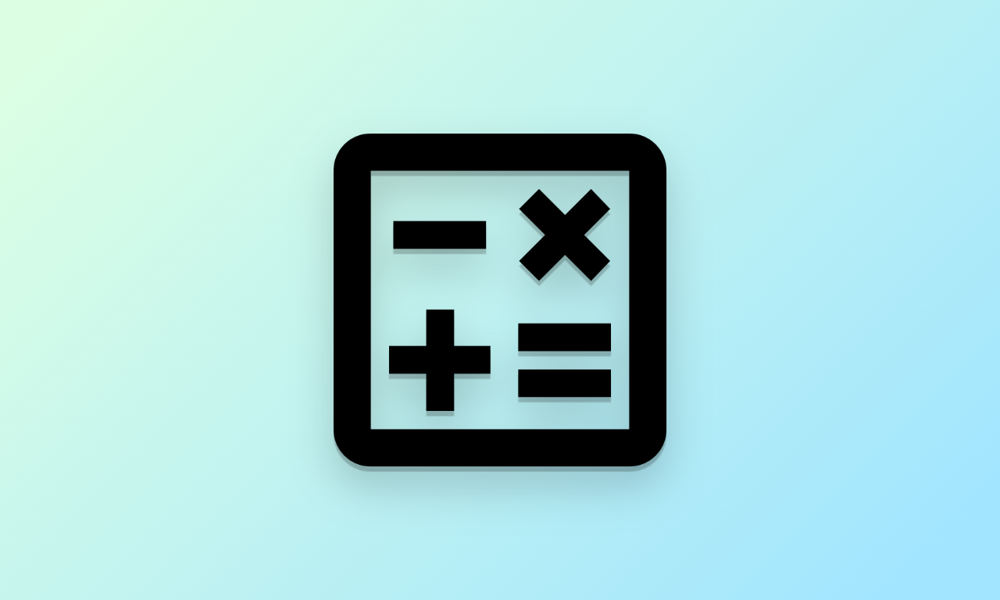
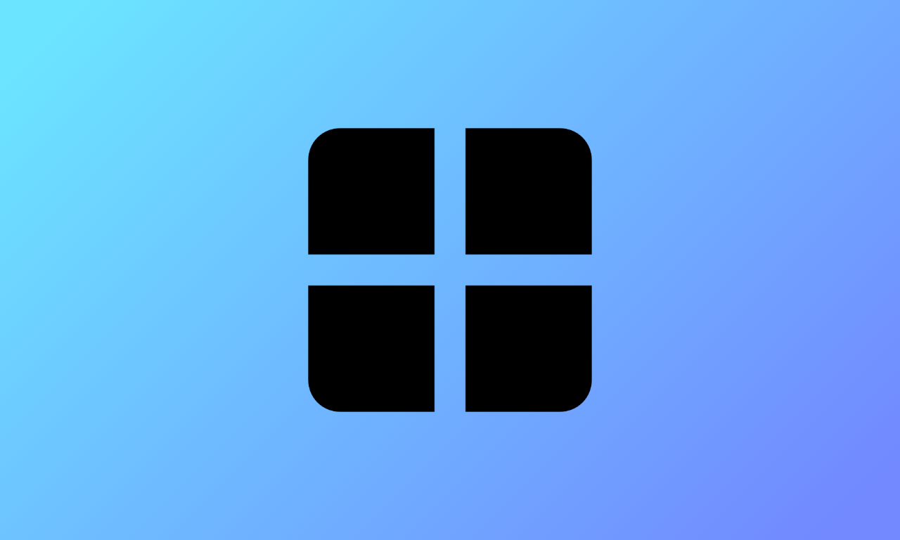
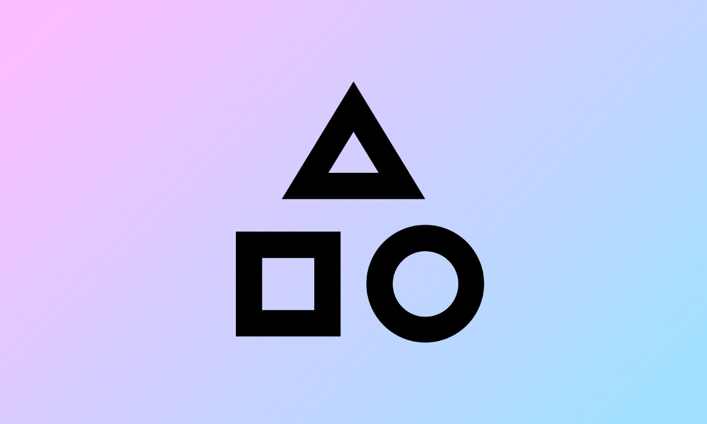
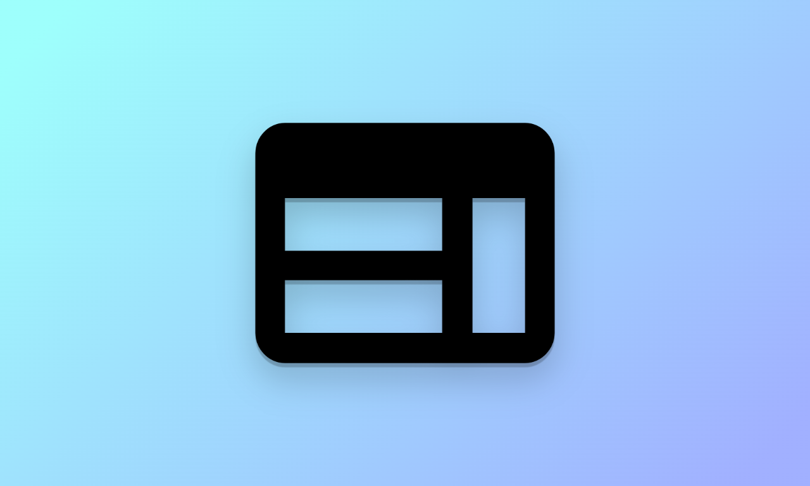

<article onclick="goTo('math')">
  <h3>Matemáticas</h3>
  
  
Conoce los fundamentos matemáticos

</article>

<article hidden onclick="goTo('english')">
  <h3>English</h3>
  
  
Learn and practice english every day

</article>

<article onclick="goTo('computing')">
  <h3>Computación</h3>
  
  
Todo lo relacionado a las computadoras

</article>

<article onclick="goTo('windows')">
  <h3>Windows</h3>
  
  
Aprende a usar tu PC Windows

</article>

<article onclick="goTo('programming')">
  <h3>Programación</h3>
  
  
Todo lo que debes saber sobre la programación

</article>

<article onclick="goTo('html')">
  <h3>HTML</h3>
  
  
Todo lo que debes saber sobre HTML

</article>

<article id="suggestions" onclick="window.open('mailto:larg.apps@gmail.com')">
  <h3>¿Algo más?</h3>
  
Díme sobre qué otros temas quieres aprender o si crees que algo de la app debe mejorar

</article>